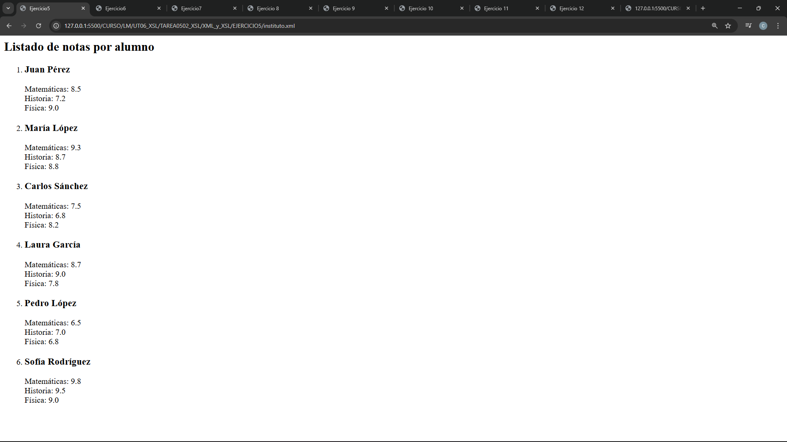
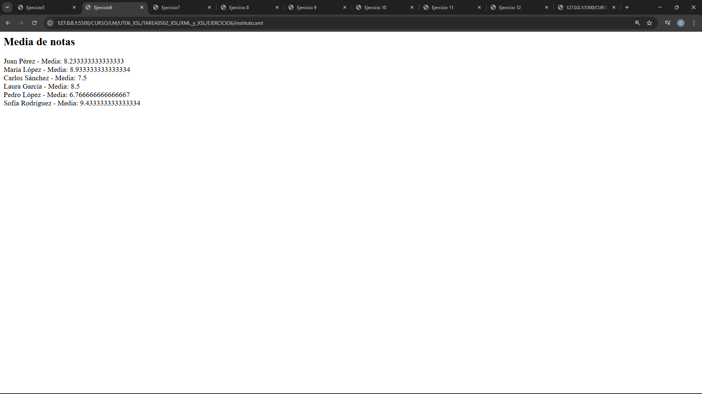
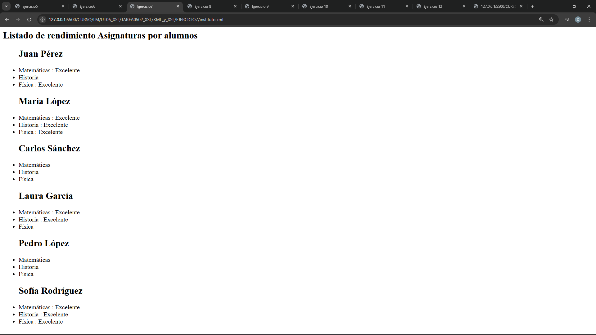
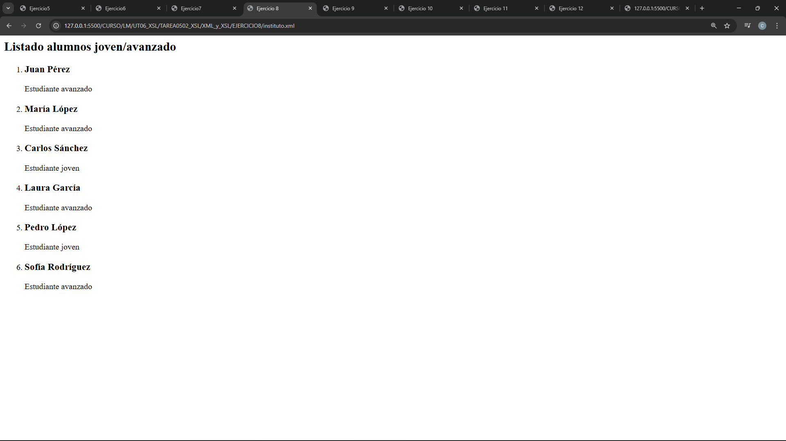
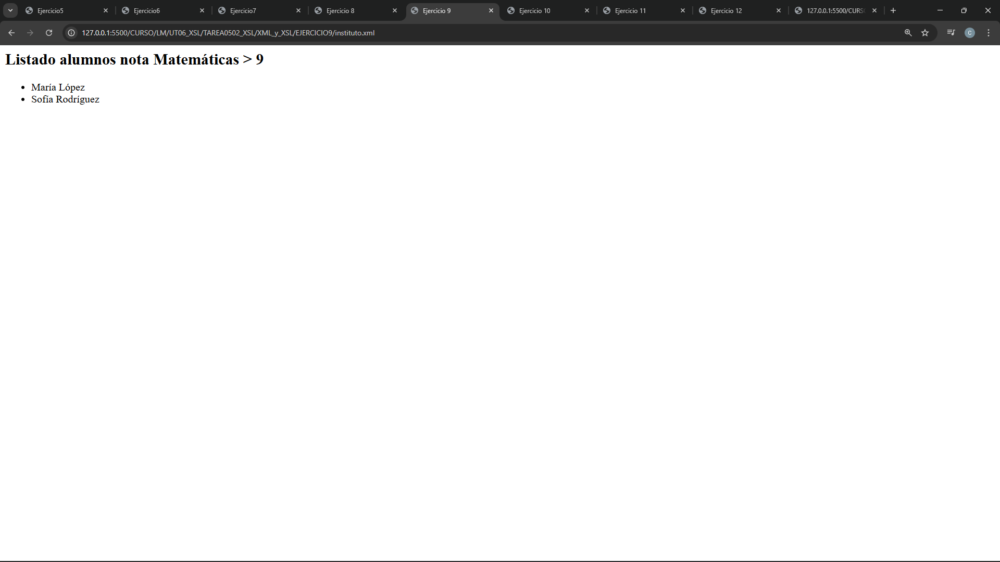
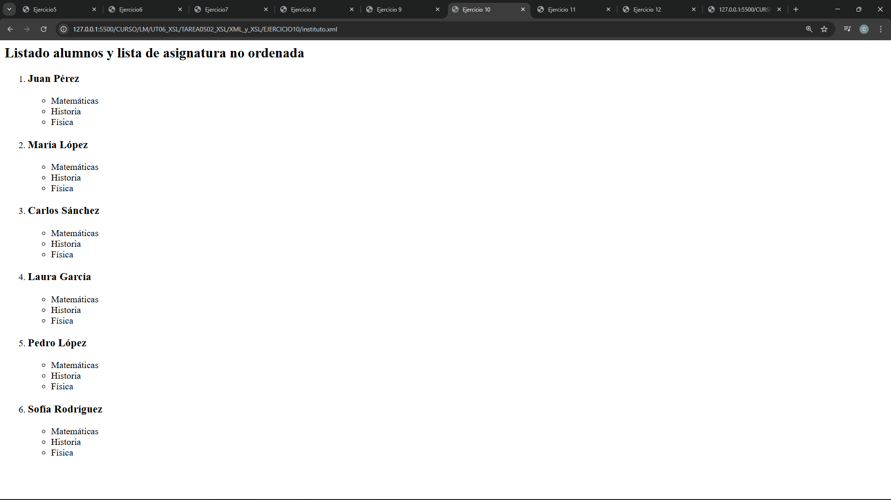
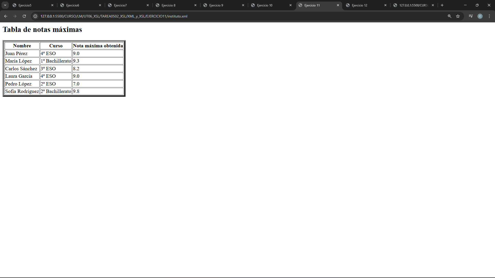
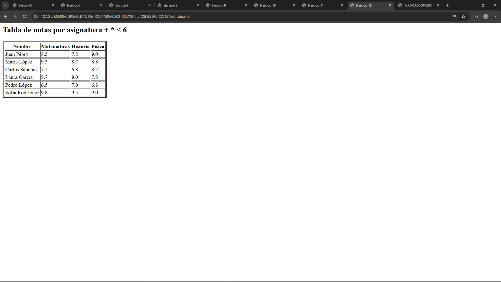

**0502 TAREA XSLT**

Crea los archivos **XSL** necesarios para extraer la siguiente información del archivo **XML adjunto**.

Para cada enunciado:

* Inserta en un pdf **una captura de pantalla del resultado obtenido**.
* Adjunta **cada uno de los pares de archivos XML y XSL asociados**.

---

### 1

Extrae y muestra **el nombre de la escuela** en un encabezado `<h1>` y **la dirección** en un párrafo `<p>`.

---

### 2

Crea un **listado de alumnos** en el que cada uno aparezca con **su nombre como encabezado `<h2>`** y **su curso en un párrafo `<p>`**.

---

### 3

Ordena a los alumnos **por nombre alfabéticamente** y genera un listado con **su nombre y edad**.

---

### 4

Muestra **solo los alumnos que están en el curso "4º ESO"** con su **nombre y curso**.

---

### 5

Genera un listado que indique **el nombre del alumno** y, en un párrafo, muestre **las notas de todas las asignaturas** en el formato:

```
Asignatura: Nota
```


<br/>  

---
### 6

Calcula **la media de las notas de cada alumno** y muéstrala junto a su nombre.

**Nota:**
La función `avg()` **no está disponible en XPath 1.0**, que es la versión compatible con **XSLT 1.0**.
Por tanto, debes calcular la media **utilizando funciones compatibles con XPath 1.0**, como `sum()` y `count()`.


<br/>  

---

### 7

Crea un listado en el que, por cada asignatura de un alumno, se indique **la asignatura** y, **si la nota es mayor o igual a 8.5**, añade al lado el texto:

```
Excelente
```  


<br/>  

---

### 8

Genera un listado de alumnos indicando **el nombre** y un mensaje diferente dependiendo de su edad:

* Menores de 16: **"Estudiante joven"**
* 16 años o más: **"Estudiante avanzado"**  


<br/>  

---

### 9

Filtra a los alumnos que **tienen una nota mayor a 9 en "Matemáticas"** y genera un listado con **sus nombres**.


<br/>  

---

### 10

Crea un **listado de alumnos** y, para cada uno de ellos, muestra **sus asignaturas en una lista no ordenada** (`<ul>`).


<br/>  

---

### 11

Crea **una tabla** con una fila por alumno que muestre:

* **Nombre**
* **Curso**
* **Nota máxima obtenida**


<br/>  

---

### 12

Crea **una tabla** que muestre **el nombre de cada alumno** y **sus notas en cada asignatura en columnas**, indicando con **un asterisco (*)** las notas **menores a 6**.


<br/>  

---

# REQUISITOS PARA SUPERAR LA TAREA

**RF1:** Se entregan **capturas de pantalla correctamente incrustadas** correspondientes a **los 8 últimos ejercicios (del 5 al 12)**.

**RF2:** Se entregan **los 8 pares de archivos XML y XSL correspondientes a los ejercicios del 5 al 12**, correctamente enlazados o incluidos en la entrega.

**RNF1:** Se utiliza el mínimo XPath necesario: **es una tarea de XSL, no uses por ejemplo un `filtro []` si se puede hacer con un `if`**